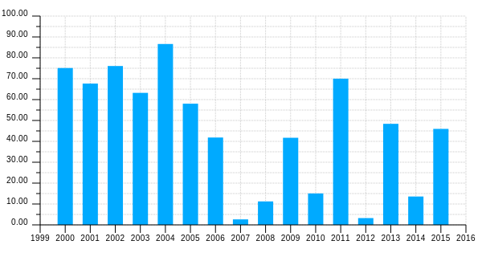
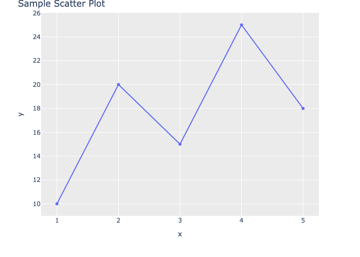

```clj
(ns gfm-and-cljdoc
  (:require [scicloj.kindly.v4.kind :as kind]
            [scicloj.clay.v2.config :as config]))
```
This namespace demonstrates the creation of an article intended for [cljdoc](https://cljdoc.org/)

Why would you want to do that?

* Code examples of how to use your library
* Charts and other visualizations
* `cljdoc` is available online, offline, and used by many tools to provide in-editor help

Github Flavored Markdown (GFM) is limited in that it cannot display JavaScript based visualizations.
However it can display SVG images:
```clj
(kind/hiccup
 [:svg {:width 600}
  [:circle {:r 50 :cx 50 :cy 50 :fill "#8FB5FE"}]
  [:circle {:r 20 :cx 50 :cy 50 :fill "#91DC47"}]])
```


Note that a width is required to show the SVG as an image.

We aim in the future to provide static versions of many visualizations.
For now if you want to make charts and so forth, look for libraries that produce SVG,
like `thi.ng/geom`.
```clj
(require '[thi.ng.geom.viz.core :as viz])

(require '[thi.ng.geom.svg.core :as svg])

(require '[thi.ng.math.core :as m])

(defn bar-spec
  [num width]
  (fn [idx col]
    {:values     (map (fn [i] [i (m/random 100)]) (range 2000 2016))
     :attribs    {:stroke       col
                  :stroke-width (str (dec width) "px")}
     :layout     viz/svg-bar-plot
     :interleave num
     :bar-width  width
     :offset     idx}))

(def viz-spec
  {:x-axis (viz/linear-axis
            {:domain [1999 2016]
             :range  [50 580]
             :major  1
             :pos    280
             :label  (viz/default-svg-label int)})
   :y-axis (viz/linear-axis
            {:domain      [0 100]
             :range       [280 20]
             :major       10
             :minor       5
             :pos         50
             :label-dist  15
             :label-style {:text-anchor "end"}})
   :grid   {:minor-y true}})

(-> viz-spec
    (assoc :data [((bar-spec 1 20) 0 "#0af")])
    (viz/svg-plot2d-cartesian)
    (->> (svg/svg {:viewbox [0 0 600 320]
                   :width "600px"
                   :height "320px"}))
    (kind/hiccup {:caption "a barchart using thi.ng/geom"}))
```


You can find more chart examples at [thi.ng/geom Visualizations](https://github.com/thi-ng/geom/blob/feature/no-org/org/examples/viz/demos.org).

What did Clay do? It took the SVG hiccup above, wrote it to a file, added an image markdown like:

```markdown

```

Note that GFM also allows

```markdown

```

Though it's unclear the best way to request that yet.
Possibly in a kindly/option in the future.

What did we have to do? We created some hiccup, and annotated it with `kind/hiccup`.
`kind/hiccup` can take an optional second argument, which is where we passed `{:caption "..."}`,
which is used when creating the image markdown.
When not present, it will be blank.
For GFM, the caption is only used as alt text, which is not visible on the page,
but important for accessiblity.

There is experimental support for saving Tableplot charts as PNG files.
It is experimental because it currently shells out to Python to create the image.
To use it you will need to install Python3, as well as some dependencies.

Make sure you have installed plotly and kaleido in your Python environment:
    pip install plotly kaleido

If you prefer to use a virtual environment:
    python3 -m venv .venv
    source .venv/bin/activate
    pip install plotly kaleido

Now we can use Tableplot inside GFM...
```clj
(require '[tablecloth.api :as tc])

(require '[scicloj.tableplot.v1.plotly :as tp])

(def scatter-ds
  (tc/dataset {:x [1 2 3 4 5]
               :y [10 20 15 25 18]}))

(-> scatter-ds
    (tp/base {:=title "Sample Scatter Plot"})
    (tp/layer-point {:=x :x
                     :=y :y}))
```


Tableplot is so nice and concise for creating charts.

The main idea of using a Clay notebook for documentation is that you can conveniently
create example code that actually calls your library and displays the results.
To illustrate this,
let's look at a little known feature of clay, checking the default configuration:
```clj
(require '[scicloj.clay.v2.config :as config])

(config/default-config)

;; =>
{:kindly/options
 {:datatables
  {:paging false,
   :scrollY 400,
   :sPaginationType "full_numbers",
   :order []},
  :test-mode :sequential},
 :base-target-path "docs",
 :format [:html],
 :quarto
 {:format
  {:html {:toc true, :toc-depth 4, :theme :cosmo},
   :revealjs
   {:theme :solarized,
    :navigation-mode :vertical,
    :transition :slide,
    :background-transition :fade,
    :incremental true}}},
 :flatten-targets true,
 :browse true,
 :live-reload false,
 :run-quarto true,
 :subdirs-to-sync ["src" "notebooks"],
 :show true,
 :keep-sync-root true}

```
Clay draws on config from several places, including a project level clay.edn file if present.
In order to see what configurations are present, we can call `config`:
```clj
(config/config)

;; =>
{:remote-repo
 {:git-url "https://github.com/scicloj/clay", :branch "main"},
 :kindly/options
 {:datatables
  {:paging false,
   :scrollY 400,
   :sPaginationType "full_numbers",
   :order []},
  :test-mode :sequential},
 :base-target-path "temp",
 :format [:html],
 :quarto
 {:format
  {:html
   {:toc true, :toc-depth 4, :theme [:cosmo "notebooks/custom.scss"]},
   :revealjs
   {:theme :solarized,
    :navigation-mode :vertical,
    :transition :slide,
    :background-transition :fade,
    :incremental true}},
  :include-in-header
  {:text
   "<meta property=\"og:image\" content=\"notebooks/images/Clay.svg.png\"/>\n<meta property=\"og:title\" content=\"Clay documentation\"/>\n<meta property=\"og:description\" content=\"A minimalistic Clojure tool for data visualization and literate programming\"/>\n"}},
 :flatten-targets true,
 :browse true,
 :favicon "notebooks/favicon.ico",
 :source-paths [nil],
 :live-reload false,
 :run-quarto true,
 :subdirs-to-sync ["src" "notebooks"],
 :show true,
 :keep-sync-root true}

```
This config contains extra contextual configuration specific to this project.

How do you build GFM with Clay?
```clj
(comment
  (require '[scicloj.clay.v2.api :as clay])
  (clay/make! {:base-source-path "notebooks"
               :source-path "gfm_and_cljdoc.clj"
               :base-target-path "docs"
               :format [:gfm]}))
```
We pass `:format [:gfm]` in our configuration along with the regular options.

This article is writen to `docs/gfm_and_cljdoc.md`, which cljdoc will detect automatically
and include in it's documentation that gets published to [cljdoc](https://cljdoc.org/).
Builds of cljdoc are triggered by releases of your library.
Note that Github will also publish files in the `docs` directory by default,
though you can change that in your project settings if you don't like it.

I hope you find interesting ways to supliment your documentation using Clay and cljdoc.